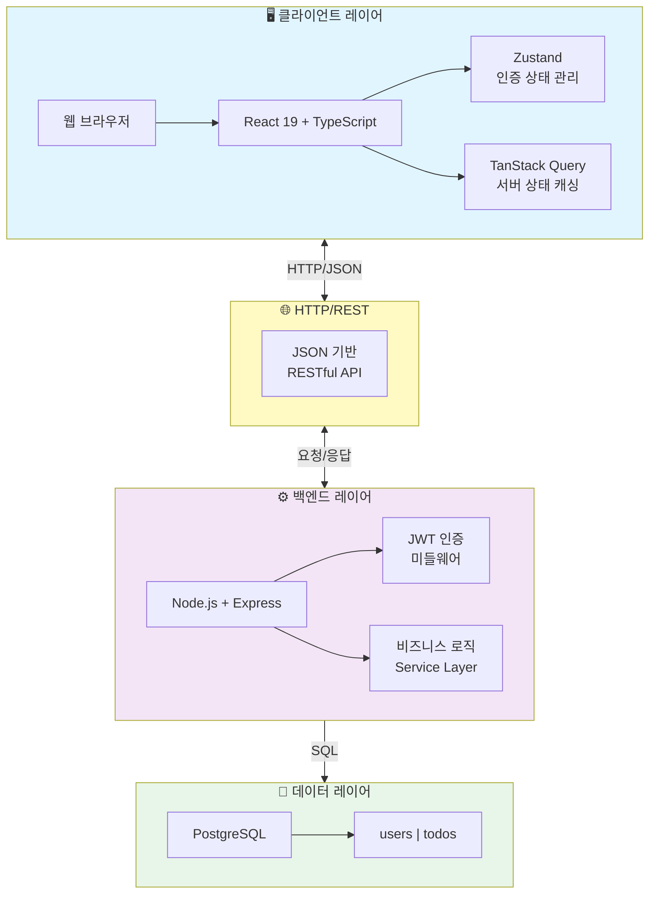
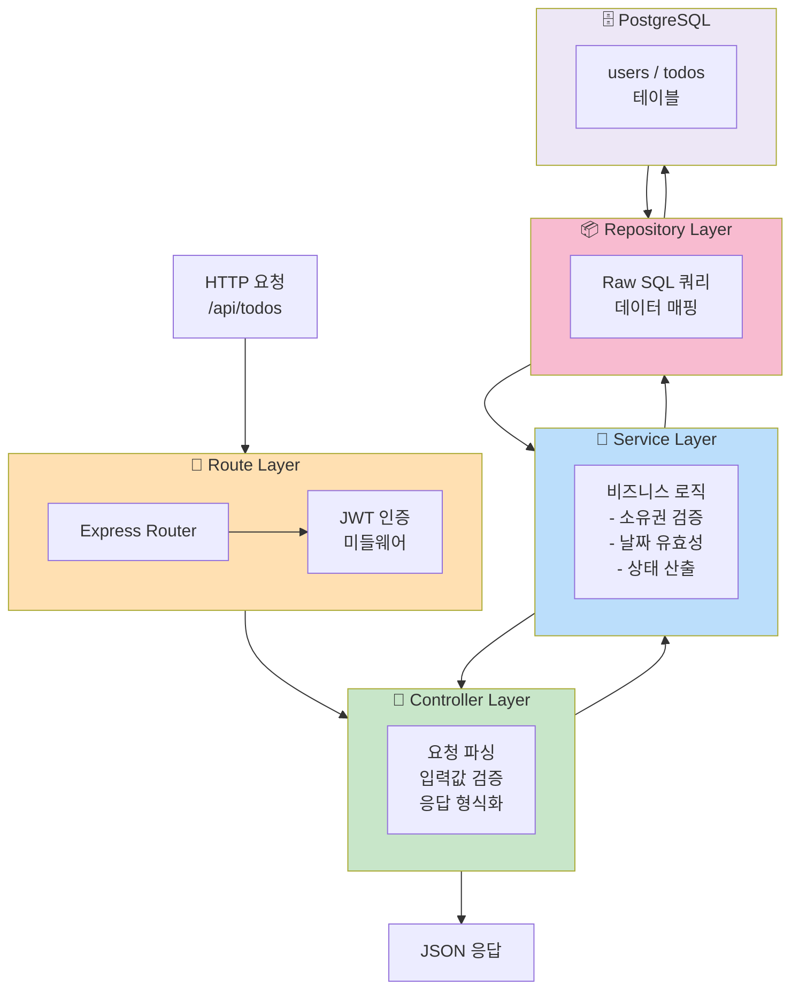
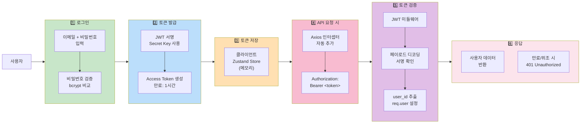
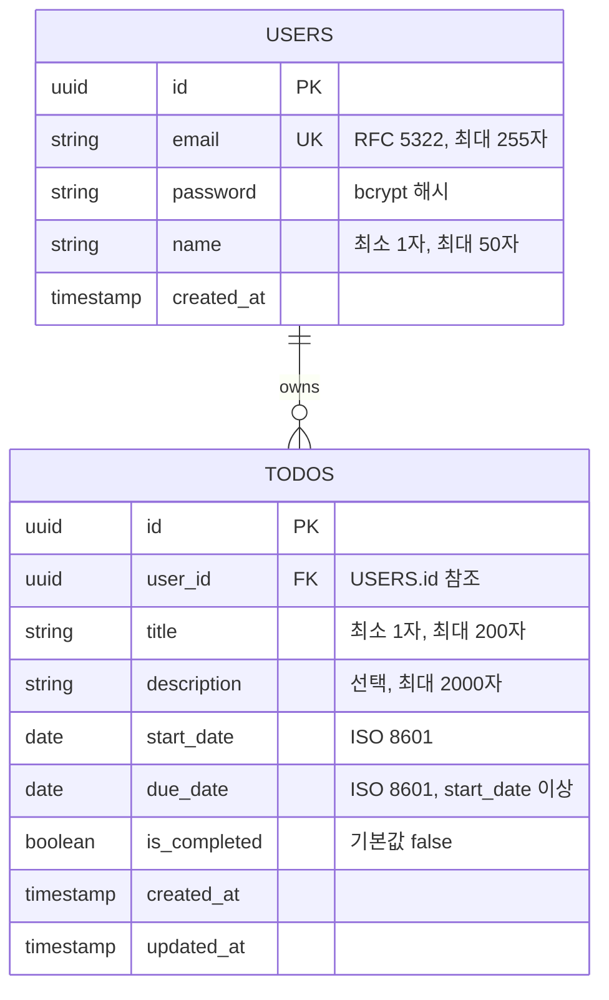
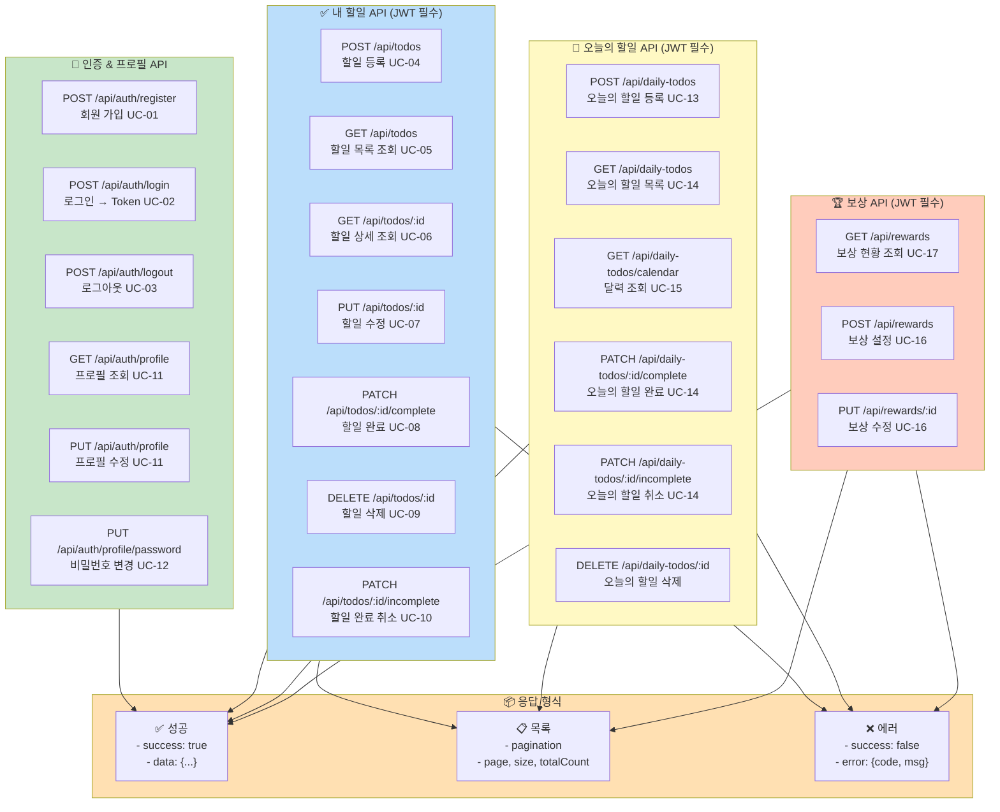
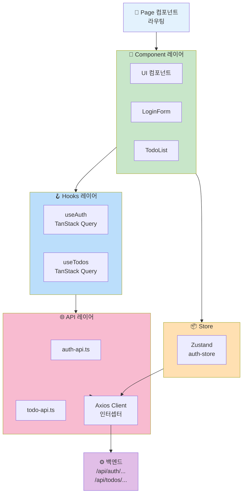
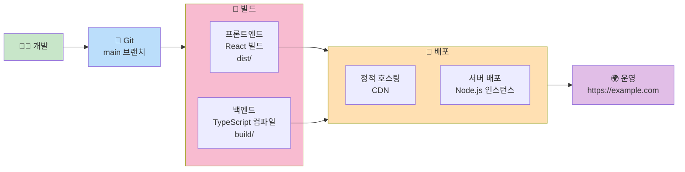

# 기술 아키텍처 다이어그램

## 변경 이력

| 버전 | 변경일 | 변경 내용 | 작성자 |
|------|--------|-----------|--------|
| v1.0.0 | 2026-03-31 | 최초 작성 | - |
| v1.1.0 | 2026-04-01 | ERD/DDL에서 status 컬럼 제거, users에서 updated_at 제거, 인증 흐름도 토큰 저장 수정, docs 목록에 6-erd.md 추가 | - |
| v1.2.0 | 2026-04-02 | daily_todos, rewards 테이블 DDL 추가, 프로젝트 구조 업데이트 (daily-todo-routes, reward-routes 추가) | - |

---

## 1. 시스템 전체 구조도 (3-Tier 아키텍처)



---

## 2. 백엔드 레이어 흐름도



---

## 3. 인증 흐름도 (JWT 토큰)



---

## 4. 엔티티-관계 다이어그램 (ERD)



---

## 5. API 엔드포인트 흐름



---

## 6. 프론트엔드 데이터 흐름



---

## 7. 데이터베이스 스키마

### users 테이블

```sql
CREATE TABLE users (
    id UUID PRIMARY KEY DEFAULT gen_random_uuid(),
    email VARCHAR(255) UNIQUE NOT NULL,
    password VARCHAR(255) NOT NULL,  -- bcrypt 해시
    name VARCHAR(50) NOT NULL,
    created_at TIMESTAMP DEFAULT CURRENT_TIMESTAMP
);
```

### todos 테이블 (내 할일)

```sql
CREATE TABLE todos (
    id UUID PRIMARY KEY DEFAULT gen_random_uuid(),
    user_id UUID NOT NULL REFERENCES users(id) ON DELETE CASCADE,
    title VARCHAR(200) NOT NULL,
    description VARCHAR(2000),
    start_date DATE NOT NULL,
    due_date DATE NOT NULL CHECK (due_date >= start_date),
    is_completed BOOLEAN NOT NULL DEFAULT FALSE,
    created_at TIMESTAMP DEFAULT CURRENT_TIMESTAMP,
    updated_at TIMESTAMP DEFAULT CURRENT_TIMESTAMP
);

CREATE INDEX idx_todos_user_id ON todos(user_id);
```

> **참고:** 할일 상태는 `start_date`, `due_date`, `is_completed`, 현재 날짜로부터 산출되는 파생 값이므로 별도 컬럼으로 저장하지 않는다. ([도메인 정의서 §5](./1-domain-definition.md#5-할일-상태-정의), [ERD §1](./6-erd.md#1-엔티티-관계-다이어그램) 참조)

### daily_todos 테이블 (오늘의 할일)

```sql
CREATE TABLE daily_todos (
    id UUID PRIMARY KEY DEFAULT gen_random_uuid(),
    user_id UUID NOT NULL REFERENCES users(id) ON DELETE CASCADE,
    title VARCHAR(200) NOT NULL,
    description VARCHAR(2000),
    start_date DATE NOT NULL,
    due_date DATE NOT NULL CHECK (due_date >= start_date),
    is_completed BOOLEAN NOT NULL DEFAULT FALSE,
    created_at TIMESTAMP DEFAULT CURRENT_TIMESTAMP,
    updated_at TIMESTAMP DEFAULT CURRENT_TIMESTAMP
);

CREATE INDEX idx_daily_todos_user_id ON daily_todos(user_id);
```

> **참고:** 오늘의 할일은 todos 테이블과 완전 독립된 별도 시스템이다. (BR-12 참조)

### rewards 테이블 (보상)

```sql
CREATE TABLE rewards (
    id UUID PRIMARY KEY DEFAULT gen_random_uuid(),
    user_id UUID NOT NULL REFERENCES users(id) ON DELETE CASCADE,
    milestone INT NOT NULL,                      -- 10, 30, 100
    tier VARCHAR(20) NOT NULL,                  -- 'small', 'medium', 'large'
    title VARCHAR(200) NOT NULL,                -- 보상 제목 (사용자 작성)
    description VARCHAR(2000),                  -- 보상 상세 (사용자 작성)
    is_achieved BOOLEAN NOT NULL DEFAULT FALSE, -- 달성 여부 (자동 달성)
    achieved_at TIMESTAMP,                      -- 달성 일시
    created_at TIMESTAMP DEFAULT CURRENT_TIMESTAMP,
    updated_at TIMESTAMP DEFAULT CURRENT_TIMESTAMP,
    UNIQUE(user_id, milestone)                  -- 사용자당 마일스톤별 1개 (BR-16)
);

CREATE INDEX idx_rewards_user_id ON rewards(user_id);
```

> **참고:** 마일스톤은 10, 30, 100이며, 오늘의 할일 완료 개수 기준으로 자동 달성된다. (UC-17, BR-17 참조)

---

## 8. 프로젝트 구조 (모노레포)

```mermaid
graph TD
    Root["todolist-app<br/>모노레포"]
    
    subgraph Frontend["frontend/"]
        public["public/"]
        src["src/"]
        src_api["api/ (auth-api, todo-api, daily-todo-api, reward-api)"]
        src_comp["components/ (auth, todo, daily-todo, reward, common)"]
        src_hooks["hooks/ (useAuth, useTodos, useDailyTodos, useRewards)"]
        src_pages["pages/ (LoginPage, TodoListPage, ProfilePage, DailyTodoPage, RewardPage)"]
        src_stores["stores/ (auth-store, theme-store)"]
        src_types["types/ (auth, todo, daily-todo, reward, api)"]
        src_utils["utils/ (validation, date, format)"]
        
        src --> src_api
        src --> src_comp
        src --> src_hooks
        src --> src_pages
        src --> src_stores
        src --> src_types
        src --> src_utils
    end
    
    subgraph Backend["backend/"]
        bsrc["src/"]
        config["config/ (db, env)"]
        controllers["controllers/ (auth, todo, daily-todo, reward)"]
        middlewares["middlewares/ (auth, error)"]
        repositories["repositories/ (user, todo, daily-todo, reward)"]
        routes["routes/ (auth, todo, daily-todo, reward, index)"]
        services["services/ (auth, todo, daily-todo, reward)"]
        btypes["types/ (auth, todo, daily-todo, reward, express.d)"]
        utils["utils/ (password, jwt, error)"]
        btests["tests/ (unit, integration)"]
        
        bsrc --> config
        bsrc --> controllers
        bsrc --> middlewares
        bsrc --> repositories
        bsrc --> routes
        bsrc --> services
        bsrc --> btypes
        bsrc --> utils
    end
    
    subgraph Docs["docs/"]
        doc1["1-domain-definition.md"]
        doc2["2-prd.md"]
        doc3["3-user-scenario.md"]
        doc4["4-project-structure.md"]
        doc5["5-arch-diagram.md"]
        doc6["6-erd.md"]
    end
    
    Root --> Frontend
    Root --> Backend
    Root --> Docs
    Root --> ".gitignore"
    Root --> "README.md"
    
    Frontend --> "package.json"
    Frontend --> "tsconfig.json"
    Frontend --> "vite.config.ts"
    Backend --> "package.json"
    Backend --> "tsconfig.json"
    
    style Frontend fill:#e3f2fd
    style Backend fill:#f3e5f5
    style Docs fill:#fff9c4
```

---

## 9. 배포 흐름



---

## 10. 기술 스택 요약

### 프론트엔드

| 계층 | 기술 | 용도 |
|-----|------|------|
| UI Framework | React 19 + TypeScript | 컴포넌트 기반 UI |
| 상태 관리 | Zustand | 인증 토큰, UI 상태 (클라이언트) |
| 서버 상태 | TanStack Query | API 데이터 페칭, 캐싱 |
| HTTP Client | Axios | RESTful API 통신 |
| 번들러 | Vite | 개발·빌드 도구 |
| 코드 스타일 | ESLint, Prettier | 린팅, 포매팅 |

### 백엔드

| 계층 | 기술 | 용도 |
|-----|------|------|
| 런타임 | Node.js | JavaScript 서버 |
| 프레임워크 | Express | RESTful API 서버 |
| 언어 | TypeScript | 타입 안정성 |
| 데이터베이스 | PostgreSQL | 관계형 데이터 저장 |
| 드라이버 | pg | 순수 SQL 실행 |
| 인증 | JWT (jsonwebtoken) | 토큰 기반 인증 |
| 비밀번호 | bcrypt | 해시 암호화 |
| 검증 | Express Validator | 입력값 검증 |
| 테스트 | Jest, Supertest | 단위·통합 테스트 |

---

## 11. 핵심 설계 원칙

### 아키텍처 원칙

1. **3-Tier 분리**: 프론트엔드-백엔드-DB 완전 분리
2. **RESTful API**: HTTP 표준 메서드 사용
3. **Stateless 인증**: JWT 토큰 방식 (서버 세션 없음)
4. **ORM 미사용**: Raw SQL로 쿼리 투명성 확보
5. **레이어 단방향**: Route → Controller → Service → Repository

### 코드 원칙

- **Type Safety**: TypeScript 100% 커버리지
- **Separation of Concerns**: 레이어별 책임 명확화
- **No Circular Dependencies**: 순환 의존성 금지
- **API 표준화**: 요청/응답 형식 통일

### 보안 원칙

- JWT Secret 환경 변수 관리
- bcrypt를 이용한 비밀번호 해시
- CORS 헤더 설정
- 소유권 검증 (403 Forbidden)

---

## 12. 참조 문서

| 문서명 | 경로 | 버전 | 설명 |
|--------|------|------|------|
| 도메인 정의서 | [./1-domain-definition.md](./1-domain-definition.md) | v1.2.0 | 도메인 모델 (Todo, DailyTodo, Reward), 유스케이스, 비즈니스 규칙 |
| PRD | [./2-prd.md](./2-prd.md) | v1.0.0 | 기술 스택, 목표, 마일스톤 |
| 사용자 시나리오 | [./3-user-scenario.md](./3-user-scenario.md) | v1.1.0 | 실제 사용자 흐름 (SCN-01 ~ SCN-17) |
| 프로젝트 구조 | [./4-project-structure.md](./4-project-structure.md) | v1.0.0 | 디렉토리, 레이어, 네이밍 규칙 |
| ERD | [./6-erd.md](./6-erd.md) | v1.0.0 | 엔티티 관계 다이어그램 |
| 실행계획서 | [./7-execution-plan.md](./7-execution-plan.md) | v1.1.0 | 프로젝트 Task 및 완료 상태 |

---

## 13. 다이어그램 사용 가이드

### 다이어그램별 용도

- **§1 시스템 전체 구조도**: 전체 아키텍처 이해, 외부 인사 교육
- **§2 백엔드 레이어 흐름도**: API 요청-응답 흐름, 백엔드 개발자 온보딩
- **§3 인증 흐름도**: JWT 생명주기, 보안 검토
- **§4 ERD**: 데이터 구조, DB 설계 검토
- **§5 API 엔드포인트**: API 명세, 프론트엔드 개발
- **§6 프론트엔드 데이터 흐름**: 상태 관리 이해, 프론트엔드 개발
- **§8 프로젝트 구조**: 파일 탐색, 온보딩

### 수정 시 주의사항

- Mermaid 문법이 변경되었을 경우 반드시 프리뷰로 검증
- 새로운 엔드포인트 추가 시 §5 다이어그램 업데이트
- 테이블 스키마 변경 시 §4 및 §7 업데이트
- 레이어 구조 변경 시 §2 및 §6 업데이트
- 버전 업그레이드 시 §10 기술 스택 수정

