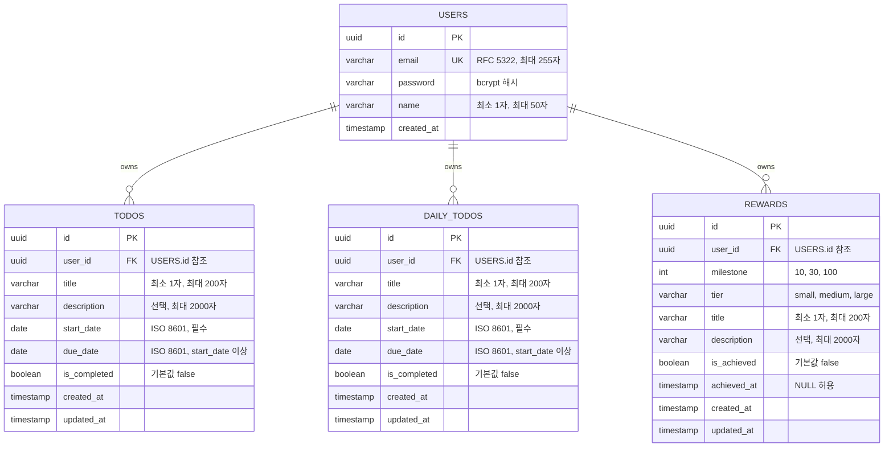

# ERD (Entity-Relationship Diagram)

## 변경 이력

| 버전 | 변경일 | 변경 내용 | 작성자 |
|------|--------|-----------|--------|
| v1.0.0 | 2026-04-01 | 최초 작성 | - |
| v1.1.0 | 2026-04-02 | 오늘의 할일(daily_todos) 및 보상(rewards) 테이블 추가 | - |

---

## 1. 엔티티-관계 다이어그램



> **참고:** 할일 상태(시작전/진행중/완료 실패/성공 완료)는 `start_date`, `due_date`, `is_completed`, 현재 날짜로부터 산출되는 파생 값이므로 별도 컬럼으로 저장하지 않는다. ([도메인 정의서 §5](./1-domain-definition.md#5-할일-상태-정의) 참조)

---

## 2. 테이블 명세

### 2.1 users

| 컬럼 | 타입 | 제약 조건 | 설명 |
|------|------|-----------|------|
| id | UUID | PK, DEFAULT gen_random_uuid() | 사용자 고유 식별자 |
| email | VARCHAR(255) | UNIQUE, NOT NULL | 로그인 이메일 |
| password | VARCHAR(255) | NOT NULL | bcrypt 해시 비밀번호 |
| name | VARCHAR(50) | NOT NULL | 사용자 이름 |
| created_at | TIMESTAMP | DEFAULT CURRENT_TIMESTAMP | 계정 생성 일시 |

### 2.2 todos

| 컬럼 | 타입 | 제약 조건 | 설명 |
|------|------|-----------|------|
| id | UUID | PK, DEFAULT gen_random_uuid() | 할일 고유 식별자 |
| user_id | UUID | FK(users.id), NOT NULL, ON DELETE CASCADE | 소유 사용자 |
| title | VARCHAR(200) | NOT NULL | 할일 제목 |
| description | VARCHAR(2000) | NULL 허용 | 할일 상세 설명 |
| start_date | DATE | NOT NULL | 할일 시작일 |
| due_date | DATE | NOT NULL, CHECK(due_date >= start_date) | 할일 종료일 |
| is_completed | BOOLEAN | NOT NULL, DEFAULT FALSE | 완료 여부 |
| created_at | TIMESTAMP | DEFAULT CURRENT_TIMESTAMP | 생성 일시 |
| updated_at | TIMESTAMP | DEFAULT CURRENT_TIMESTAMP | 최종 수정 일시 |

### 2.3 daily_todos

| 컬럼 | 타입 | 제약 조건 | 설명 |
|------|------|-----------|------|
| id | UUID | PK, DEFAULT gen_random_uuid() | 오늘의 할일 고유 식별자 |
| user_id | UUID | FK(users.id), NOT NULL, ON DELETE CASCADE | 소유 사용자 |
| title | VARCHAR(200) | NOT NULL | 오늘의 할일 제목 |
| description | VARCHAR(2000) | NULL 허용 | 오늘의 할일 상세 설명 |
| start_date | DATE | NOT NULL | 시작일 |
| due_date | DATE | NOT NULL, CHECK(due_date >= start_date) | 종료일 |
| is_completed | BOOLEAN | NOT NULL, DEFAULT FALSE | 완료 여부 |
| created_at | TIMESTAMP | DEFAULT CURRENT_TIMESTAMP | 생성 일시 |
| updated_at | TIMESTAMP | DEFAULT CURRENT_TIMESTAMP | 최종 수정 일시 |

### 2.4 rewards

| 컬럼 | 타입 | 제약 조건 | 설명 |
|------|------|-----------|------|
| id | UUID | PK, DEFAULT gen_random_uuid() | 보상 고유 식별자 |
| user_id | UUID | FK(users.id), NOT NULL, ON DELETE CASCADE | 소유 사용자 |
| milestone | INT | NOT NULL | 마일스톤 (10, 30, 100) |
| tier | VARCHAR(20) | NOT NULL | 보상 등급 (small, medium, large) |
| title | VARCHAR(200) | NOT NULL | 보상 제목 (사용자 입력) |
| description | VARCHAR(2000) | NULL 허용 | 보상 상세 설명 (사용자 입력) |
| is_achieved | BOOLEAN | NOT NULL, DEFAULT FALSE | 달성 여부 |
| achieved_at | TIMESTAMP | NULL 허용 | 달성 일시 |
| created_at | TIMESTAMP | DEFAULT CURRENT_TIMESTAMP | 생성 일시 |
| updated_at | TIMESTAMP | DEFAULT CURRENT_TIMESTAMP | 최종 수정 일시 |

---

## 3. 인덱스

| 테이블 | 인덱스명 | 컬럼 | 용도 |
|--------|----------|------|------|
| users | idx_users_email | email | 로그인 시 이메일 조회 (UNIQUE 제약으로 자동 생성) |
| todos | idx_todos_user_id | user_id | 사용자별 할일 목록 조회 |
| daily_todos | idx_daily_todos_user_id | user_id | 사용자별 오늘의 할일 목록 조회 |
| rewards | idx_rewards_user_id | user_id | 사용자별 보상 목록 조회 |

---

## 4. DDL

```sql
CREATE TABLE users (
    id UUID PRIMARY KEY DEFAULT gen_random_uuid(),
    email VARCHAR(255) UNIQUE NOT NULL,
    password VARCHAR(255) NOT NULL,
    name VARCHAR(50) NOT NULL,
    created_at TIMESTAMP DEFAULT CURRENT_TIMESTAMP
);

CREATE TABLE todos (
    id UUID PRIMARY KEY DEFAULT gen_random_uuid(),
    user_id UUID NOT NULL REFERENCES users(id) ON DELETE CASCADE,
    title VARCHAR(200) NOT NULL,
    description VARCHAR(2000),
    start_date DATE NOT NULL,
    due_date DATE NOT NULL CHECK (due_date >= start_date),
    is_completed BOOLEAN NOT NULL DEFAULT FALSE,
    created_at TIMESTAMP DEFAULT CURRENT_TIMESTAMP,
    updated_at TIMESTAMP DEFAULT CURRENT_TIMESTAMP
);

CREATE TABLE daily_todos (
    id UUID PRIMARY KEY DEFAULT gen_random_uuid(),
    user_id UUID NOT NULL REFERENCES users(id) ON DELETE CASCADE,
    title VARCHAR(200) NOT NULL,
    description VARCHAR(2000),
    start_date DATE NOT NULL,
    due_date DATE NOT NULL CHECK (due_date >= start_date),
    is_completed BOOLEAN NOT NULL DEFAULT FALSE,
    created_at TIMESTAMP DEFAULT CURRENT_TIMESTAMP,
    updated_at TIMESTAMP DEFAULT CURRENT_TIMESTAMP
);

CREATE TABLE rewards (
    id UUID PRIMARY KEY DEFAULT gen_random_uuid(),
    user_id UUID NOT NULL REFERENCES users(id) ON DELETE CASCADE,
    milestone INT NOT NULL,
    tier VARCHAR(20) NOT NULL,
    title VARCHAR(200) NOT NULL,
    description VARCHAR(2000),
    is_achieved BOOLEAN NOT NULL DEFAULT FALSE,
    achieved_at TIMESTAMP,
    created_at TIMESTAMP DEFAULT CURRENT_TIMESTAMP,
    updated_at TIMESTAMP DEFAULT CURRENT_TIMESTAMP,
    UNIQUE(user_id, milestone)
);

CREATE INDEX idx_todos_user_id ON todos(user_id);
CREATE INDEX idx_daily_todos_user_id ON daily_todos(user_id);
CREATE INDEX idx_rewards_user_id ON rewards(user_id);
```

---

## 5. 참조 문서

| 문서명 | 경로 | 버전 |
|--------|------|------|
| 도메인 정의서 | [./1-domain-definition.md](./1-domain-definition.md) | v1.1.0 |
| PRD | [./2-prd.md](./2-prd.md) | v1.1.0 |
| 프로젝트 구조 | [./4-project-structure.md](./4-project-structure.md) | v1.1.0 |
