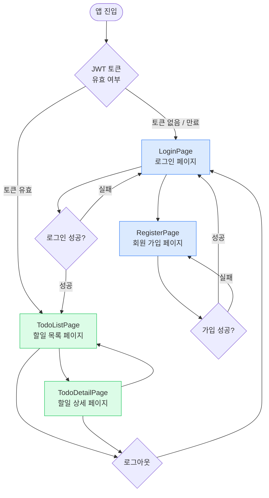
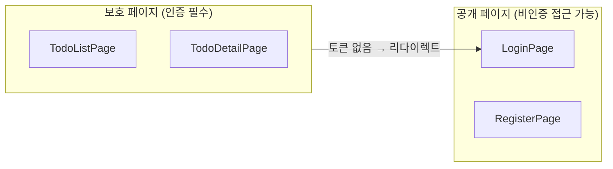
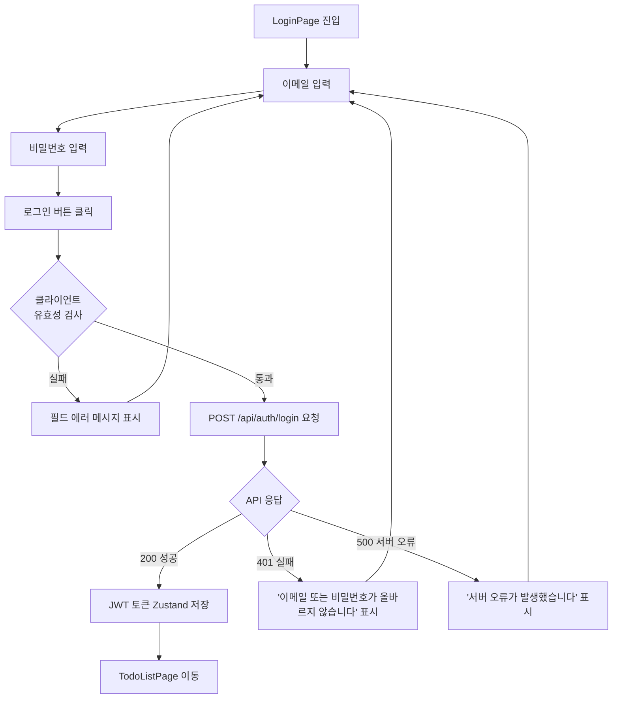
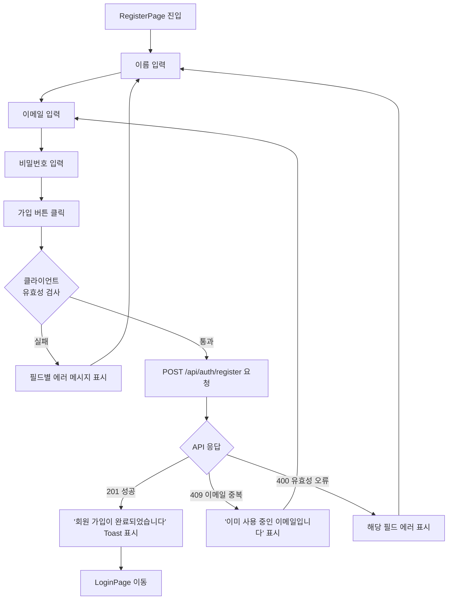
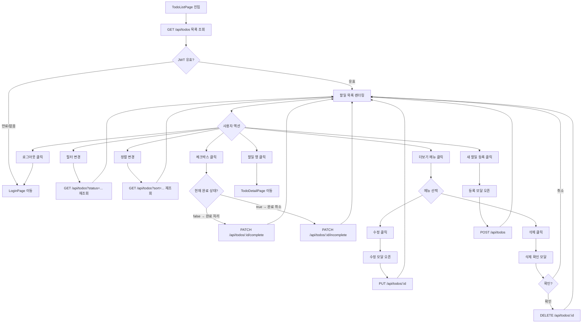
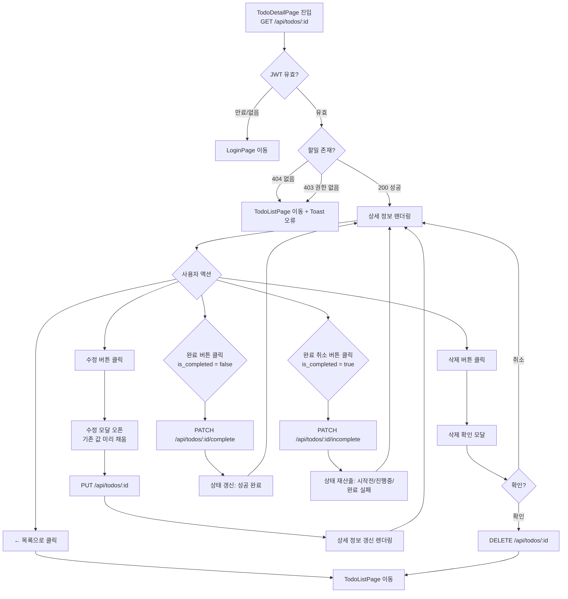
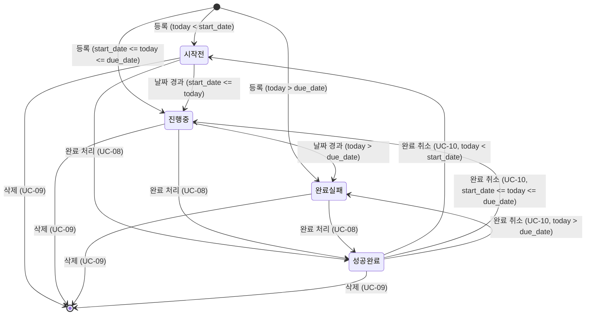
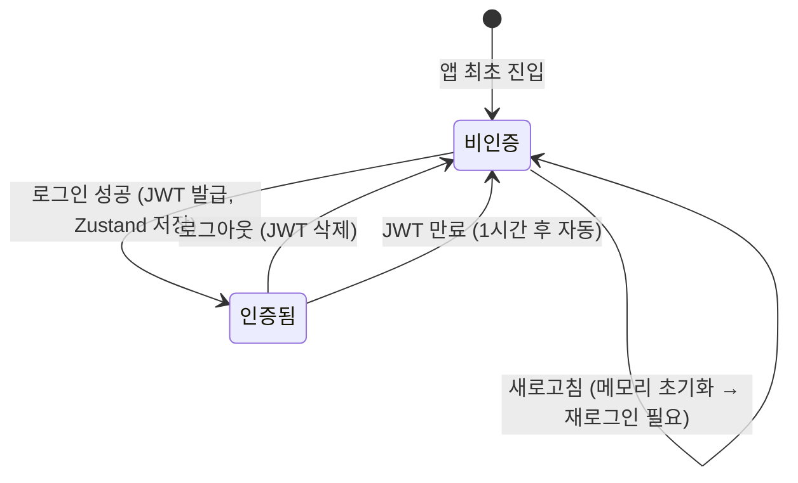

# 와이어프레임 문서

## 변경 이력

| 버전 | 변경일 | 변경 내용 | 작성자 |
|------|--------|-----------|--------|
| v1.0.0 | 2026-04-01 | 최초 작성 (4개 페이지 전체 와이어프레임 + 공통 컴포넌트 정의) | - |

---

## 1. 개요

| 항목 | 내용 |
|------|------|
| 프로젝트명 | todolist-app |
| 문서 목적 | 전체 페이지의 레이아웃 구조, UI 요소, 인터랙션 흐름, 반응형 차이점 정의 |
| 작성일 | 2026-04-01 |
| 문서 버전 | v1.0.0 |
| 기반 문서 | 도메인 정의서 v1.1.1, PRD v1.0.1, 사용자 시나리오 v1.0.0, 프로젝트 구조 v1.0.0 |
| 대상 페이지 | LoginPage, RegisterPage, TodoListPage, TodoDetailPage |
| 반응형 범위 | 모바일 360px ~ 데스크탑 1280px |

---

## 2. 화면 전환 흐름도

페이지 간 전체 네비게이션 흐름을 나타낸다.



### 2.1 인증 상태별 접근 제어



---

## 3. 공통 컴포넌트 정의

### 3.1 Header 컴포넌트

인증 상태에 따라 두 가지 형태로 표시된다.

```
┌─────────────────────────────────────────────────────────────────┐
│  [로고] Todo App                         [사용자명]  [로그아웃]  │  ← 인증 상태
└─────────────────────────────────────────────────────────────────┘

┌─────────────────────────────────────────────────────────────────┐
│  [로고] Todo App                                                 │  ← 비인증 상태
└─────────────────────────────────────────────────────────────────┘
```

| 요소 | 설명 | 표시 조건 |
|------|------|-----------|
| 로고 (Todo App) | 클릭 시 LoginPage 또는 TodoListPage로 이동 | 항상 표시 |
| 사용자명 | Zustand store의 로그인된 사용자 이름 표시 | 인증 상태만 |
| 로그아웃 버튼 | 클릭 시 토큰 삭제 후 LoginPage 이동 | 인증 상태만 |

**모바일 Header (360px ~ 767px)**
```
┌─────────────────────────┐
│  [로고] Todo App  [≡]   │
└─────────────────────────┘
```
- 햄버거 메뉴([≡]) 클릭 시 드롭다운으로 사용자명 + 로그아웃 표시

---

### 3.2 StatusBadge 컴포넌트

할일 상태를 색상 뱃지로 시각적으로 구분한다.

| 상태 | 표시 텍스트 | 배경색 | 텍스트 색 |
|------|------------|--------|-----------|
| 시작전 (Pending) | 시작전 | 회색 (#e5e7eb) | 진한 회색 (#374151) |
| 진행중 (In Progress) | 진행중 | 파란색 (#dbeafe) | 파란색 (#1d4ed8) |
| 완료 실패 (Overdue) | 완료 실패 | 빨간색 (#fee2e2) | 빨간색 (#dc2626) |
| 성공 완료 (Completed) | 성공 완료 | 초록색 (#dcfce7) | 초록색 (#15803d) |

```
[ 시작전 ]   [ 진행중 ]   [ 완료 실패 ]   [ 성공 완료 ]
  (회색)      (파란색)      (빨간색)        (초록색)
```

---

### 3.3 Modal 컴포넌트 (확인 다이얼로그)

삭제 확인 등 사용자 동작 확인이 필요한 경우 사용한다.

```
┌─────────────────────────────────────┐
│            할일 삭제                 │
│─────────────────────────────────────│
│  이 할일을 삭제하시겠습니까?          │
│  삭제된 데이터는 복구할 수 없습니다.  │
│                                     │
│         [취소]      [삭제]           │
└─────────────────────────────────────┘
```

| 요소 | 설명 |
|------|------|
| 오버레이 | 배경 반투명 처리, 클릭 시 모달 닫기 |
| 제목 | 동작 유형 표시 |
| 본문 | 확인 메시지 |
| 취소 버튼 | 모달 닫기, 동작 중단 |
| 확인 버튼 | 동작 실행 (삭제 등) |

---

### 3.4 FormField 컴포넌트

입력 필드 + 레이블 + 에러 메시지의 묶음 단위 컴포넌트.

```
레이블 *
┌────────────────────────────────┐
│  입력 내용                      │
└────────────────────────────────┘
  ⚠ 에러 메시지가 여기에 표시됩니다.
```

| 상태 | 테두리 색 | 설명 |
|------|-----------|------|
| 기본 | 회색 | 입력 전 기본 상태 |
| 포커스 | 파란색 | 입력 중 강조 |
| 에러 | 빨간색 | 유효성 검증 실패 |
| 성공 | 초록색 | 유효성 검증 통과 |

---

### 3.5 Pagination 컴포넌트

할일 목록 하단에 표시되는 페이지 네비게이션.

```
         전체 47건  20건/페이지
  [<]  1  [2]  3  [>]
```

| 요소 | 설명 |
|------|------|
| 이전 버튼 ([<]) | 첫 페이지에서 비활성화 |
| 페이지 번호 | 현재 페이지 강조 표시, 클릭 시 해당 페이지로 이동 |
| 다음 버튼 ([>]) | 마지막 페이지에서 비활성화 |
| 전체 건수 | 현재 필터 기준 전체 건수 |

---

### 3.6 Toast 알림 컴포넌트

API 처리 결과를 화면 우측 상단에 일시적으로 표시한다.

```
                     ┌──────────────────────────┐
                     │  ✓ 할일이 등록되었습니다.  │  ← 성공 (초록)
                     └──────────────────────────┘

                     ┌──────────────────────────┐
                     │  ✕ 오류가 발생했습니다.   │  ← 에러 (빨간)
                     └──────────────────────────┘
```

- 3초 후 자동 소멸
- 여러 개 쌓일 경우 수직으로 나열

---

## 4. LoginPage (로그인 페이지)

### 4.1 페이지 목적

- 기존 계정을 보유한 사용자가 이메일과 비밀번호로 인증하여 서비스에 진입한다.
- 인증 성공 시 JWT Access Token을 Zustand 메모리에 저장하고 TodoListPage로 이동한다.
- 관련 시나리오: SCN-02

### 4.2 레이아웃 구조

**데스크탑 (768px 이상)**

```
┌─────────────────────────────────────────────────────────────────┐
│  HEADER: [로고] Todo App                                        │
├─────────────────────────────────────────────────────────────────┤
│                                                                 │
│                  ┌──────────────────────┐                      │
│                  │       로그인          │                      │
│                  │──────────────────────│                      │
│                  │  이메일               │                      │
│                  │  [_______________]   │                      │
│                  │                      │                      │
│                  │  비밀번호             │                      │
│                  │  [_______________]   │                      │
│                  │                      │                      │
│                  │  ⚠ 에러 메시지 영역   │                      │
│                  │                      │                      │
│                  │  [   로그인 버튼   ]  │                      │
│                  │                      │                      │
│                  │  계정이 없으신가요?   │                      │
│                  │  [회원 가입]          │                      │
│                  └──────────────────────┘                      │
│                                                                 │
└─────────────────────────────────────────────────────────────────┘
```

**모바일 (360px ~ 767px)**

```
┌─────────────────────────┐
│  HEADER: [로고] Todo App │
├─────────────────────────┤
│                         │
│  로그인                  │
│                         │
│  이메일                  │
│  [___________________]  │
│                         │
│  비밀번호                │
│  [___________________]  │
│                         │
│  ⚠ 에러 메시지 영역      │
│                         │
│  [     로그인 버튼     ]  │
│                         │
│  계정이 없으신가요?      │
│  [회원 가입]             │
│                         │
└─────────────────────────┘
```

### 4.3 UI 요소 목록

| UI 요소 | 타입 | 필수 | 유효성 규칙 | 설명 |
|---------|------|------|------------|------|
| 이메일 | Input (email) | Y | RFC 5322 형식 | placeholder: "이메일을 입력하세요" |
| 비밀번호 | Input (password) | Y | - | placeholder: "비밀번호를 입력하세요", 마스킹 처리 |
| 로그인 버튼 | Button (submit) | - | - | 클릭 시 폼 제출, 로딩 중 비활성화 |
| 에러 메시지 영역 | Text | - | - | API 오류 시 인라인 표시 |
| 회원 가입 링크 | Link | - | - | RegisterPage로 이동 |

### 4.4 사용자 인터랙션 흐름



### 4.5 에러 상태 표시 방법

| 에러 상황 | 표시 위치 | 표시 메시지 |
|-----------|-----------|-------------|
| 이메일 미입력 | 이메일 필드 하단 | "이메일을 입력해 주세요." |
| 이메일 형식 오류 | 이메일 필드 하단 | "올바른 이메일 형식이 아닙니다." |
| 비밀번호 미입력 | 비밀번호 필드 하단 | "비밀번호를 입력해 주세요." |
| 이메일/비밀번호 불일치 (EX-02-1, EX-02-2) | 폼 상단 에러 박스 | "이메일 또는 비밀번호가 올바르지 않습니다." |
| 서버 오류 | 폼 상단 에러 박스 | "서버 오류가 발생했습니다. 잠시 후 다시 시도해 주세요." |

### 4.6 반응형 차이점

| 항목 | 모바일 (360px~767px) | 데스크탑 (768px~) |
|------|---------------------|------------------|
| 폼 컨테이너 | 전체 너비, 좌우 패딩 16px | 중앙 정렬, 최대 너비 400px, 카드 형태 |
| 제목 글자 크기 | 20px | 24px |
| Header | 로고만 표시 | 로고만 표시 (비인증 상태) |
| 버튼 | 전체 너비 | 전체 너비 (폼 내) |

---

## 5. RegisterPage (회원 가입 페이지)

### 5.1 페이지 목적

- 신규 사용자가 이름, 이메일, 비밀번호를 입력하여 계정을 생성한다.
- 가입 성공 시 LoginPage로 이동하여 바로 로그인할 수 있다.
- 관련 시나리오: SCN-01

### 5.2 레이아웃 구조

**데스크탑 (768px 이상)**

```
┌─────────────────────────────────────────────────────────────────┐
│  HEADER: [로고] Todo App                                        │
├─────────────────────────────────────────────────────────────────┤
│                                                                 │
│                  ┌──────────────────────┐                      │
│                  │       회원 가입       │                      │
│                  │──────────────────────│                      │
│                  │  이름 *              │                      │
│                  │  [_______________]   │                      │
│                  │                      │                      │
│                  │  이메일 *            │                      │
│                  │  [_______________]   │                      │
│                  │                      │                      │
│                  │  비밀번호 *          │                      │
│                  │  [_______________]   │                      │
│                  │  ℹ 8자 이상,         │                      │
│                  │    영문+숫자+특수문자  │                      │
│                  │                      │                      │
│                  │  ⚠ 에러 메시지 영역   │                      │
│                  │                      │                      │
│                  │  [   가입 버튼    ]   │                      │
│                  │                      │                      │
│                  │  이미 계정이 있으신가요?│                     │
│                  │  [로그인]            │                      │
│                  └──────────────────────┘                      │
│                                                                 │
└─────────────────────────────────────────────────────────────────┘
```

**모바일 (360px ~ 767px)**

```
┌─────────────────────────┐
│  HEADER: [로고] Todo App │
├─────────────────────────┤
│                         │
│  회원 가입               │
│                         │
│  이름 *                  │
│  [___________________]  │
│                         │
│  이메일 *                │
│  [___________________]  │
│                         │
│  비밀번호 *              │
│  [___________________]  │
│  ℹ 8자 이상,            │
│    영문+숫자+특수문자     │
│                         │
│  ⚠ 에러 메시지 영역      │
│                         │
│  [       가입 버튼     ]  │
│                         │
│  이미 계정이 있으신가요?  │
│  [로그인]                │
│                         │
└─────────────────────────┘
```

### 5.3 UI 요소 목록

| UI 요소 | 타입 | 필수 | 유효성 규칙 | 설명 |
|---------|------|------|------------|------|
| 이름 | Input (text) | Y | 1~50자, 공백만 불가 | placeholder: "이름을 입력하세요" |
| 이메일 | Input (email) | Y | RFC 5322, 최대 255자 | placeholder: "이메일을 입력하세요" |
| 비밀번호 | Input (password) | Y | 8자 이상, 영문+숫자+특수문자 | placeholder: "비밀번호를 입력하세요", 마스킹 처리 |
| 비밀번호 안내 | Helper Text | - | - | 비밀번호 정책 설명 문구 |
| 가입 버튼 | Button (submit) | - | - | 클릭 시 폼 제출, 로딩 중 비활성화 |
| 에러 메시지 영역 | Text | - | - | API 오류 시 인라인 표시 |
| 로그인 링크 | Link | - | - | LoginPage로 이동 |

### 5.4 사용자 인터랙션 흐름



### 5.5 에러 상태 표시 방법

| 에러 상황 | 표시 위치 | 표시 메시지 |
|-----------|-----------|-------------|
| 이름 미입력 (EX-01-1) | 이름 필드 하단 | "이름을 입력해 주세요." |
| 이름 50자 초과 (EX-01-1) | 이름 필드 하단 | "이름은 50자 이하로 입력해 주세요." |
| 이메일 형식 오류 (EX-01-2) | 이메일 필드 하단 | "올바른 이메일 형식이 아닙니다." |
| 비밀번호 정책 위반 (EX-01-3) | 비밀번호 필드 하단 | "비밀번호는 8자 이상이며 영문, 숫자, 특수문자를 각 1자 이상 포함해야 합니다." |
| 이메일 중복 (EX-01-4) | 폼 상단 에러 박스 | "이미 사용 중인 이메일입니다." |

### 5.6 반응형 차이점

| 항목 | 모바일 (360px~767px) | 데스크탑 (768px~) |
|------|---------------------|------------------|
| 폼 컨테이너 | 전체 너비, 좌우 패딩 16px | 중앙 정렬, 최대 너비 440px, 카드 형태 |
| 제목 글자 크기 | 20px | 24px |
| 버튼 | 전체 너비 | 전체 너비 (폼 내) |

---

## 6. TodoListPage (할일 목록 페이지)

### 6.1 페이지 목적

- 로그인한 사용자의 할일 목록을 필터, 정렬, 페이지네이션과 함께 제공한다.
- 할일 등록(모달 또는 인라인 폼), 완료 처리, 완료 취소, 삭제를 이 페이지에서 수행한다.
- 관련 시나리오: SCN-03, SCN-04, SCN-05, SCN-08, SCN-09, SCN-10

### 6.2 레이아웃 구조

**데스크탑 (768px 이상)**

```
┌─────────────────────────────────────────────────────────────────┐
│  HEADER: [로고] Todo App              [홍길동]  [로그아웃]       │
├─────────────────────────────────────────────────────────────────┤
│                                                                 │
│  내 할일 목록                          [+ 새 할일 등록]          │
│                                                                 │
│  ┌─────────────────────────────────────────────────────────┐   │
│  │  필터:  [전체▼]  [시작전]  [진행중]  [완료 실패]         │   │
│  │         [성공 완료]  [종료된 할일]                        │   │
│  │                                                          │   │
│  │  정렬:  [시작일▼]  [오름차순 ↑ / 내림차순 ↓]            │   │
│  └─────────────────────────────────────────────────────────┘   │
│                                                                 │
│  ┌─────────────────────────────────────────────────────────┐   │
│  │  □  제목                     상태       시작일   종료일  │   │
│  │──────────────────────────────────────────────────────── │   │
│  │  □  React 공부하기      [ 진행중 ]  04-01   04-05  [⋯]  │   │
│  │  □  보고서 작성          [ 시작전 ]  04-03   04-07  [⋯]  │   │
│  │  ☑  디자인 완료      [ 성공 완료 ]  03-25   03-31  [⋯]  │   │
│  │  □  버그 수정       [ 완료 실패 ]  03-20   03-28  [⋯]  │   │
│  │  ...                                                     │   │
│  └─────────────────────────────────────────────────────────┘   │
│                                                                 │
│         전체 47건  20건/페이지    [<]  1  [2]  3  [>]          │
│                                                                 │
└─────────────────────────────────────────────────────────────────┘
```

**모바일 (360px ~ 767px)**

```
┌─────────────────────────┐
│ [로고] Todo App    [≡]  │
├─────────────────────────┤
│                         │
│  내 할일 목록            │
│  [+  새 할일 등록 ]      │
│                         │
│  ┌─────────────────┐    │
│  │ 필터: [전체 ▼]  │    │
│  │ 정렬: [시작일 ▼]│    │
│  │       [오름차순▼]│    │
│  └─────────────────┘    │
│                         │
│  ┌─────────────────┐    │
│  │ □ React 공부하기 │    │
│  │   [ 진행중 ]    │    │
│  │   04-01 ~ 04-05 │    │
│  │           [⋯ ▼] │    │
│  ├─────────────────┤    │
│  │ □ 보고서 작성    │    │
│  │   [ 시작전 ]    │    │
│  │   04-03 ~ 04-07 │    │
│  │           [⋯ ▼] │    │
│  ├─────────────────┤    │
│  │ ☑ 디자인 완료   │    │
│  │  [ 성공 완료 ]  │    │
│  │  03-25 ~ 03-31  │    │
│  │           [⋯ ▼] │    │
│  └─────────────────┘    │
│                         │
│  전체 47건               │
│  [<]  1  [2]  3  [>]   │
│                         │
└─────────────────────────┘
```

### 6.3 UI 요소 목록

| UI 요소 | 타입 | 설명 |
|---------|------|------|
| 새 할일 등록 버튼 | Button | 클릭 시 할일 등록 모달 오픈 (SCN-04) |
| 상태 필터 탭/셀렉트 | Tab / Select | 전체, 시작전, 진행중, 완료 실패, 성공 완료, 종료된 할일 (BR-05, BR-09) |
| 정렬 기준 셀렉트 | Select | 시작일, 종료일 (BR-06) |
| 정렬 방향 버튼 | Toggle Button | 오름차순 / 내림차순 (BR-06) |
| 할일 체크박스 | Checkbox | 체크 시 완료 처리, 재클릭 시 완료 취소 (UC-08, UC-10) |
| 할일 항목 행 | ListItem | 클릭 시 TodoDetailPage 이동 (UC-06) |
| StatusBadge | Badge | 할일 상태 색상 뱃지 |
| 더보기 메뉴 버튼 ([⋯]) | Icon Button | 수정 / 삭제 드롭다운 표시 |
| 수정 메뉴 항목 | Dropdown Item | 할일 수정 모달 오픈 (UC-07) |
| 삭제 메뉴 항목 | Dropdown Item | 삭제 확인 모달 오픈 (UC-09) |
| 빈 목록 안내 | Empty State | 할일이 없을 때 안내 메시지 표시 |
| 페이지네이션 | Pagination | 페이지 이동 컴포넌트 |

### 6.4 할일 등록 모달

"+ 새 할일 등록" 버튼 클릭 시 표시되는 모달 폼.

```
┌──────────────────────────────────────┐
│  새 할일 등록                    [X]  │
│──────────────────────────────────────│
│  제목 *                              │
│  [________________________________]  │
│                                      │
│  설명 (선택)                         │
│  [________________________________]  │
│  [________________________________]  │
│  [________________________________]  │
│  최대 2,000자                        │
│                                      │
│  시작일 *          종료일 *           │
│  [YYYY-MM-DD  📅]  [YYYY-MM-DD  📅]  │
│                                      │
│  ⚠ 에러 메시지 영역                  │
│                                      │
│            [취소]  [등록하기]         │
└──────────────────────────────────────┘
```

| UI 요소 | 타입 | 필수 | 유효성 규칙 |
|---------|------|------|------------|
| 제목 | Input (text) | Y | 1~200자, 공백만 불가 |
| 설명 | Textarea | N | 최대 2,000자 |
| 시작일 | Date Picker | Y | ISO 8601 형식 |
| 종료일 | Date Picker | Y | 시작일 이상 (BR-04) |
| 취소 버튼 | Button | - | 모달 닫기 |
| 등록하기 버튼 | Button (submit) | - | POST /api/todos |

### 6.5 할일 수정 모달

더보기 메뉴의 "수정" 클릭 시 표시. 기존 값이 미리 채워진 상태로 표시된다.

```
┌──────────────────────────────────────┐
│  할일 수정                       [X]  │
│──────────────────────────────────────│
│  제목 *                              │
│  [React 공부하기___________________]  │
│                                      │
│  설명 (선택)                         │
│  [공식 문서 정독 후 프로젝트 적용___]  │
│  [________________________________]  │
│                                      │
│  시작일 *          종료일 *           │
│  [2026-04-01  📅]  [2026-04-05  📅]  │
│                                      │
│  ⚠ 에러 메시지 영역                  │
│                                      │
│            [취소]  [저장하기]         │
└──────────────────────────────────────┘
```

### 6.6 삭제 확인 모달

더보기 메뉴의 "삭제" 클릭 시 표시.

```
┌─────────────────────────────────────┐
│            할일 삭제                 │
│─────────────────────────────────────│
│  'React 공부하기'을(를)              │
│  삭제하시겠습니까?                   │
│  삭제된 데이터는 복구할 수 없습니다.  │
│                                     │
│         [취소]      [삭제]           │
└─────────────────────────────────────┘
```

### 6.7 빈 목록 상태

등록된 할일이 없거나 필터 결과가 없을 때 표시.

```
┌─────────────────────────────────────┐
│                                     │
│          📋                         │
│    할일이 없습니다.                  │
│    새 할일을 등록해 보세요.           │
│                                     │
│       [+ 새 할일 등록]               │
│                                     │
└─────────────────────────────────────┘
```

필터 적용 후 결과가 없을 때:
```
  해당 조건에 맞는 할일이 없습니다.
```

### 6.8 사용자 인터랙션 흐름



### 6.9 에러 상태 표시 방법

| 에러 상황 | 표시 방법 | 메시지 |
|-----------|-----------|--------|
| 등록 폼 유효성 오류 (EX-04-2~5) | 모달 내 필드별 에러 | 각 필드 하단 인라인 표시 |
| 종료일 < 시작일 (EX-04-5) | 모달 내 에러 박스 | "종료일은 시작일 이후여야 합니다." |
| 수정 폼 유효성 오류 (EX-07-3~4) | 모달 내 필드별 에러 | 각 필드 하단 인라인 표시 |
| JWT 만료 (EX-05-1) | 자동 리다이렉트 | LoginPage로 이동 |
| 서버 오류 | Toast 알림 | "서버 오류가 발생했습니다." |
| 삭제 성공 | Toast 알림 | "할일이 삭제되었습니다." |
| 등록 성공 | Toast 알림 | "할일이 등록되었습니다." |
| 수정 성공 | Toast 알림 | "할일이 수정되었습니다." |

### 6.10 반응형 차이점

| 항목 | 모바일 (360px~767px) | 데스크탑 (768px~) |
|------|---------------------|------------------|
| 필터 UI | 드롭다운 셀렉트 1개 | 탭 버튼 나열 |
| 정렬 UI | 드롭다운 셀렉트 2개 | 셀렉트 + 토글 버튼 인라인 |
| 할일 항목 | 카드형 (세로 레이아웃) | 테이블 행 (가로 레이아웃) |
| 날짜 표시 | "시작일 ~ 종료일" 한 줄 | 별도 컬럼으로 분리 |
| 더보기 메뉴 | 항목 우측 버튼 | 행 호버 시 버튼 노출 또는 고정 |
| 등록 버튼 위치 | 제목 아래 전체 너비 | 우측 상단 |
| 모달 크기 | 전체 화면 또는 하단 시트 | 중앙 팝업 (최대 너비 520px) |
| Header | 햄버거 메뉴 | 사용자명 + 로그아웃 인라인 표시 |

---

## 7. TodoDetailPage (할일 상세 페이지)

### 7.1 페이지 목적

- 선택한 할일의 전체 정보(제목, 설명, 날짜, 상태, 메타데이터)를 조회한다.
- 이 페이지에서 수정, 완료 처리, 완료 취소, 삭제도 수행 가능하다.
- 관련 시나리오: SCN-06, SCN-07, SCN-08, SCN-09, SCN-10

### 7.2 레이아웃 구조

**데스크탑 (768px 이상)**

```
┌─────────────────────────────────────────────────────────────────┐
│  HEADER: [로고] Todo App              [홍길동]  [로그아웃]       │
├─────────────────────────────────────────────────────────────────┤
│                                                                 │
│  [← 목록으로 돌아가기]                                          │
│                                                                 │
│  ┌──────────────────────────────────────────────────────────┐  │
│  │                                                          │  │
│  │  [ 진행중 ]                           [수정]  [삭제]    │  │
│  │                                                          │  │
│  │  React 공부하기                                          │  │
│  │  ────────────────────────────────────────────────────   │  │
│  │                                                          │  │
│  │  설명                                                    │  │
│  │  공식 문서 정독 후 개인 프로젝트에 적용하기               │  │
│  │                                                          │  │
│  │  ────────────────────────────────────────────────────   │  │
│  │                                                          │  │
│  │  시작일          종료일                                  │  │
│  │  2026-04-01      2026-04-05                             │  │
│  │                                                          │  │
│  │  ────────────────────────────────────────────────────   │  │
│  │                                                          │  │
│  │  생성일시                    최종 수정일시               │  │
│  │  2026-04-01 09:00            2026-04-01 14:30           │  │
│  │                                                          │  │
│  │  ────────────────────────────────────────────────────   │  │
│  │                                                          │  │
│  │              [  완료 처리  ]                             │  │
│  │                                                          │  │
│  └──────────────────────────────────────────────────────────┘  │
│                                                                 │
└─────────────────────────────────────────────────────────────────┘
```

**성공 완료 상태인 경우 하단 버튼 영역:**

```
  │              [  완료 취소  ]                             │
```

**모바일 (360px ~ 767px)**

```
┌─────────────────────────┐
│ [로고] Todo App    [≡]  │
├─────────────────────────┤
│                         │
│  [← 목록으로]            │
│                         │
│  [ 진행중 ]              │
│                         │
│  React 공부하기          │
│  ─────────────────────  │
│                         │
│  설명                    │
│  공식 문서 정독 후        │
│  개인 프로젝트에 적용     │
│                         │
│  ─────────────────────  │
│                         │
│  시작일  2026-04-01      │
│  종료일  2026-04-05      │
│                         │
│  ─────────────────────  │
│                         │
│  생성    2026-04-01      │
│         09:00           │
│  수정    2026-04-01      │
│         14:30           │
│                         │
│  ─────────────────────  │
│                         │
│  [수정]         [삭제]   │
│                         │
│  [      완료 처리      ]  │
│                         │
└─────────────────────────┘
```

### 7.3 UI 요소 목록

| UI 요소 | 타입 | 설명 |
|---------|------|------|
| 뒤로가기 링크 | Link | "← 목록으로 돌아가기", TodoListPage로 이동 |
| StatusBadge | Badge | 현재 할일 상태 표시 |
| 제목 | Heading | 할일 제목 (읽기 전용) |
| 설명 | Text | 할일 설명 텍스트. 없을 경우 "-" 표시 |
| 시작일 | Text | YYYY-MM-DD 형식 |
| 종료일 | Text | YYYY-MM-DD 형식 |
| 생성일시 | Text | 할일 생성 일시 |
| 최종 수정일시 | Text | 할일 최종 수정 일시 |
| 수정 버튼 | Button | 수정 모달 오픈 (UC-07) |
| 삭제 버튼 | Button (danger) | 삭제 확인 모달 오픈 (UC-09) |
| 완료 처리 버튼 | Button (primary) | is_completed = false 상태일 때 표시 (UC-08) |
| 완료 취소 버튼 | Button (secondary) | is_completed = true 상태일 때 표시 (UC-10) |

### 7.4 사용자 인터랙션 흐름



### 7.5 에러 상태 표시 방법

| 에러 상황 | 표시 방법 | 메시지 |
|-----------|-----------|--------|
| 404 존재하지 않는 할일 (EX-06-2) | TodoListPage 리다이렉트 + Toast | "존재하지 않는 할일입니다." |
| 403 권한 없음 (EX-06-3) | TodoListPage 리다이렉트 + Toast | "접근 권한이 없습니다." |
| JWT 만료 (EX-06-1) | 자동 리다이렉트 | LoginPage로 이동 |
| 수정 폼 유효성 오류 | 모달 내 필드별 에러 | 각 필드 하단 인라인 표시 |
| 삭제 성공 | TodoListPage 이동 + Toast | "할일이 삭제되었습니다." |
| 완료 처리 성공 | 인라인 상태 갱신 + Toast | "할일이 완료 처리되었습니다." |
| 완료 취소 성공 | 인라인 상태 갱신 + Toast | "완료가 취소되었습니다." |
| 서버 오류 | Toast 알림 | "서버 오류가 발생했습니다." |

### 7.6 반응형 차이점

| 항목 | 모바일 (360px~767px) | 데스크탑 (768px~) |
|------|---------------------|------------------|
| 레이아웃 | 단일 컬럼, 수직 스크롤 | 최대 너비 768px 중앙 카드 |
| 수정/삭제 버튼 | 하단 영역에 가로 배치 | 상단 우측 코너 배치 |
| 날짜 표시 | 레이블 + 값 수직 배치 | 레이블 + 값 수평 배치 |
| 완료/완료취소 버튼 | 전체 너비 | 중앙 정렬 고정 너비 |
| 모달 크기 | 전체 화면 또는 하단 시트 | 중앙 팝업 (최대 너비 520px) |

---

## 8. 화면 상태 다이어그램

### 8.1 할일 상태 전환 시각화



### 8.2 인증 상태 다이어그램



---

## 9. 디자인 토큰 (권장 값)

와이어프레임 구현 시 참조할 기본 디자인 토큰.

### 9.1 색상

| 토큰명 | 색상값 | 용도 |
|--------|--------|------|
| color-primary | #3b82f6 | 주요 버튼, 링크, 포커스 테두리 |
| color-danger | #dc2626 | 삭제 버튼, 에러 상태 |
| color-success | #22c55e | 성공 Toast, 완료 상태 |
| color-warning | #f59e0b | 경고 메시지 |
| color-gray-100 | #f3f4f6 | 배경색 |
| color-gray-300 | #d1d5db | 테두리 기본색 |
| color-gray-700 | #374151 | 본문 텍스트 |
| color-gray-900 | #111827 | 제목 텍스트 |

### 9.2 상태 뱃지 색상

| 상태 | 배경 | 텍스트 |
|------|------|--------|
| 시작전 | #e5e7eb | #374151 |
| 진행중 | #dbeafe | #1d4ed8 |
| 완료 실패 | #fee2e2 | #dc2626 |
| 성공 완료 | #dcfce7 | #15803d |

### 9.3 브레이크포인트

| 이름 | 범위 | 적용 레이아웃 |
|------|------|--------------|
| mobile | 360px ~ 767px | 단일 컬럼, 카드 리스트 |
| tablet | 768px ~ 1023px | 2컬럼 가능, 테이블 레이아웃 |
| desktop | 1024px ~ 1280px+ | 전체 테이블, 사이드바 가능 |

### 9.4 간격 (Spacing)

| 토큰명 | 값 | 용도 |
|--------|----|------|
| spacing-xs | 4px | 뱃지 내부 패딩 |
| spacing-sm | 8px | 인라인 요소 간격 |
| spacing-md | 16px | 카드 패딩, 섹션 간격 |
| spacing-lg | 24px | 페이지 패딩 |
| spacing-xl | 32px | 섹션 간 여백 |

---

## 10. 접근성 (Accessibility) 고려사항

### 10.1 키보드 접근성

| 요소 | 키보드 동작 |
|------|-------------|
| 폼 입력 필드 | Tab 순서 논리적 배치 (이름 → 이메일 → 비밀번호 → 버튼) |
| 모달 | 오픈 시 포커스 모달 내부로 이동, Esc 키로 닫기 |
| 드롭다운 메뉴 | Enter/Space로 열기, 화살표 키로 항목 이동, Esc로 닫기 |
| 체크박스 | Space 키로 토글 |

### 10.2 스크린 리더 지원

| 요소 | aria 속성 |
|------|-----------|
| StatusBadge | `aria-label="할일 상태: 진행중"` |
| 체크박스 | `aria-label="React 공부하기 완료 처리"` |
| 더보기 버튼 | `aria-label="React 공부하기 메뉴 열기"` |
| 에러 메시지 | `role="alert"`, `aria-live="polite"` |
| 모달 | `role="dialog"`, `aria-modal="true"`, `aria-labelledby` |
| 로딩 상태 | `aria-busy="true"` |

### 10.3 색상 대비

- 모든 텍스트는 WCAG 2.1 AA 기준 대비율 4.5:1 이상 준수
- 상태 뱃지는 색상만으로 정보를 전달하지 않고 텍스트 레이블 병행 표시

---

## 11. 참조 문서

| 문서명 | 경로 | 버전 |
|--------|------|------|
| 도메인 정의서 | [./1-domain-definition.md](./1-domain-definition.md) | v1.1.1 |
| PRD | [./2-prd.md](./2-prd.md) | v1.0.1 |
| 사용자 시나리오 | [./3-user-scenario.md](./3-user-scenario.md) | v1.0.0 |
| 프로젝트 구조 설계 원칙 | [./4-project-structure.md](./4-project-structure.md) | v1.0.0 |
